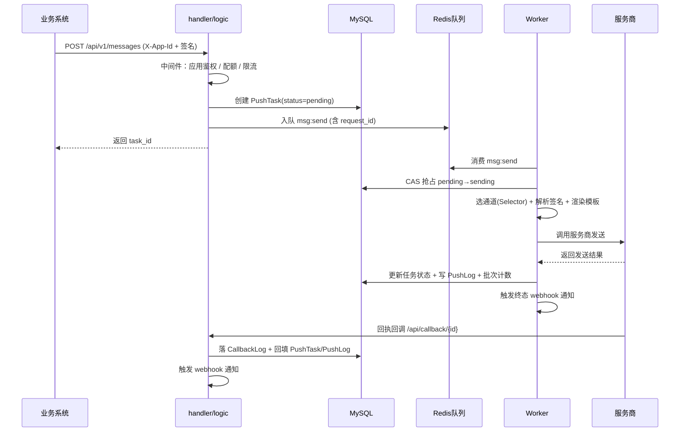

# 架构设计

msg-push 是单进程内同时承担 HTTP API、消费端 Worker 与后台调度器的统一消息投递服务。

## 总体架构

```mermaid
flowchart LR
    subgraph 调用方
        A[业务系统] -->|POST /api/v1/messages| API
    end

    subgraph msg-push
        API[HTTP API<br/>handler/logic] -->|创建任务 + 入队| Q[(Redis<br/>asynq 队列)]
        Q --> W[消息管道<br/>core/pipeline/]
        W --> P[服务商<br/>aliyun/tencent/smtp/...]
        P -->|回执回调| CB[回调接收<br/>/api/callback/{id}]
        CB --> DB[(MySQL)]
        W --> DB
        SCH[后台调度<br/>core/scheduler/] --> DB
        SCH --> WH[Webhook 投递<br/>core/scheduler/]
        WH -->|POST 通知| W2[接收方系统]
    end

    DB --- API
```

## 模块划分

### 核心分层

| 包 | 职责 |
|----|------|
| `handler/` | HTTP 层：参数绑定、统一响应 `Response[T]`、错误处理 |
| `logic/` | 业务逻辑层：校验、落库、入队、查询 |
| `model/` | GORM 数据模型（表结构） |
| `dto/` | 请求 / 响应数据结构 |
| `middleware/` | 中间件：应用鉴权、账号 JWT 鉴权、配额、限流、签名校验 |
| `core/pipeline/` | 消息处理管道：任务队列契约 + 生产者入队 + 消费者投递、规则引擎、终态流转 |
| `core/sender/` | 服务商发送器：各服务商实现 Sender / BatchSender / StatusQuerier / CallbackParser；接口/结构体/常量在 `types.go`，元信息注册表在 `sender.go`，工厂在 `factory.go`，回调在 `callback.go` |
| `core/scheduler/` | 后台调度：配额同步、短信超时扫描、状态主动补单、Webhook outbox 投递 |
| `svc/` | 依赖装配 `ServiceContext`（DB/Redis/Producer/Logger 等） |
| `config/` | 配置结构体 |
| `route/` | 路由注册与中间件链 |
| `db/` | 迁移与种子数据 |
| `webui/` | 管理后台前端（独立子模块） |

### 关键子目录

- `core/pipeline/`：消息管道（任务契约、选择器、渲染器、规则引擎、终态流转均在此包）
- `core/scheduler/`：后台调度与 Webhook 异步投递器（outbox + 重试退避）

## 一次消息投递的完整链路



## 关键机制

### 1. 异步投递（队列）

- HTTP 提交只负责**校验、落库、入队**，实际投递由消费端异步完成；
- 队列基于 Redis + asynq（`taskq`），任务类型 `msg:send` / `msg:batch`；
- 任务消费是 **at-least-once** 语义，通过 CAS 抢占（`pending→sending`）避免重复投递。

### 2. 智能路由

- `Selector` 按通道、消息类型、签名、排除列表选择服务商账号；
- 进程内缓存节点（60s TTL），熔断后立即失效；
- 无可用供应商时进入**有限指数退避重试**（默认 3 次）。

### 3. 状态流转

```
pending --CAS--> sending --发送成功--> success
     \                 \--等待回执--> sending --回执/补单/超时--> success/failed
      \--选通道失败--> 重试(pending) --超过上限--> failed
```

- 短信提交成功先置 `sending`（等待回执），避免成功数虚高；
- 终态由**回执回调 / 状态主动补单 / 超时扫描**三路写入。

### 4. 批量发送

- `POST /messages/batch` 创建批次记录 + 每接收者一条任务，整批入队 `msg:batch`；
- 消费端优先调用服务商**批量 API**（阿里/腾讯/网易短信支持）；
- 服务商不支持批量时自动**退回逐条**入队 `msg:send`，复用完整重试链路；
- Redis 锁 `msgpush:batch_lock:{batchID}` 防重复整批发送。

### 5. 全链路追踪（request_id）

- HTTP 中间件 `httpx.WithRequestID()` 从 `X-Request-Id` 读取或生成 uuid；
- `logic` 提取后写入 `PushTask.request_id` 并随队列 payload 传递；
- 消费端反序列化后用 `httpx.ContextWithRequestID` 注入 context，所有日志自动带 `request_id`；
- 回调回填 `CallbackLog.request_id`，Webhook 通知携带 `request_id`；
- 从「提交」到「投递」「回执」「webhook」全程可串联查询。

## 目录结构

```
.
├── main.go                 # 入口：装配 + 编排全部服务
├── config.yaml             # 配置
├── config/                 # 配置结构
├── route/                  # 路由
├── handler/ logic/ dto/    # HTTP 三层
├── model/                  # 数据模型
├── middleware/             # 中间件
├── core/                   # 核心后台
│   ├── pipeline/           # 消息管道：队列契约 + 生产者/消费者、选择器、渲染器、规则引擎
│   ├── scheduler/          # 后台调度：配额同步、超时扫描、状态补单、Webhook 投递
│   └── sender/             # 服务商发送器 + 服务商元信息注册表
├── svc/                    # 依赖装配
├── db/                     # 迁移与种子
├── deploy/                 # docker-compose
└── webui/                  # 管理后台（子模块）
```

## 相关文档

- [快速开始](quickstart.md)
- [配置指南](configuration.md)
- [数据模型](database.md)
- [失败处理与重试](failure-retry.md)
- [Webhook 通知](webhook.md)
- [开发者指南](development.md)
