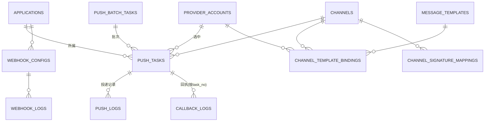

# 数据模型

所有表由 GORM `AutoMigrate` 创建（启动时自动建表）。表名前缀 `msg_`。数据库清理由运维手动完成。

## 表总览

| 表名 | 模型 | 说明 |
|------|------|------|
| `msg_applications` | Application | 接入应用（调用方） |
| `msg_accounts` | Account | 管理端账号 |
| `msg_channels` | Channel | 通道（短信/邮件/企微/钉钉） |
| `msg_message_templates` | MessageTemplate | 业务模板 |
| `msg_push_tasks` | PushTask | 推送任务 |
| `msg_push_logs` | PushLog | 推送日志 |
| `msg_push_batch_tasks` | PushBatchTask | 批量任务（批次） |
| `msg_provider_accounts` | ProviderAccount | 服务商账号 |
| `msg_provider_signatures` | ProviderSignature | 服务商签名 |
| `msg_provider_templates` | ProviderTemplate | 供应商模板 |
| `msg_channel_template_bindings` | ChannelTemplateBinding | 通道-模板绑定 |
| `msg_channel_signature_mappings` | ChannelSignatureMapping | 通道-签名映射 |
| `msg_channel_health_history` | ChannelHealthHistory | 通道健康历史 |
| `msg_failure_rules` | FailureRule | 失败规则 |
| `msg_callback_logs` | CallbackLog | 回调日志 |
| `msg_webhook_configs` | WebhookConfig | Webhook 配置 |
| `msg_webhook_logs` | WebhookLog | Webhook 投递日志 |
| `msg_app_quota_stats` | AppQuotaStat | 应用配额统计 |
| `msg_provider_quota_stats` | ProviderQuotaStat | 服务商配额统计 |

## 核心表详解

### msg_channels（通道）

| 字段 | 类型 | 说明 |
|------|------|------|
| id | uint | 主键（内部关联用） |
| code | string | 通道编码（唯一，创建后不可修改；发送接口 `channel_code` 用它定位） |
| name | string | 通道名称（唯一） |
| type | string | 类型 sms/email/wecom/dingtalk |
| config | text | 通道配置（JSON，预留） |
| status | int8 | 1 启用 / 0 禁用 |
| remark | string | 备注 |
| created_at / updated_at | time | 时间 |
| deleted_at | time | 软删除 |

### msg_message_templates（业务模板）

| 字段 | 类型 | 说明 |
|------|------|------|
| id | uint | 主键（内部关联用） |
| code | string | 模板编码（唯一，创建后不可修改；发送接口 `template_code` 用它定位） |
| channel_id | uint | 所属通道 |
| name | string | 模板名称 |
| content | text | 模板内容，支持 {key} / {{.key}} |
| signature | string | 签名/主题 |
| status | int8 | 1 启用 / 0 禁用 |
| remark | string | 备注 |
| created_at / updated_at | time | 时间 |
| deleted_at | time | 软删除 |

### msg_applications（应用）

| 字段 | 类型 | 说明 |
|------|------|------|
| id | uint | 主键 |
| app_id | string | 应用标识（唯一） |
| app_secret | string | 密钥（bcrypt） |
| app_secret_plain | string | 明文密钥（用于 HMAC 签名） |
| name | string | 应用名称 |
| status | int8 | 1 启用 / 0 禁用 |
| is_test | bool | 测试模式（不真实发送） |
| daily_quota | int | 每日配额，0=不限 |
| rate_limit | int | 每秒速率 QPS |
| remark | string | 备注 |
| created_at / updated_at | time | 时间 |
| deleted_at | time | 软删除 |

### msg_push_tasks（推送任务）

| 字段 | 说明 |
|------|------|
| task_id | 任务号（唯一，`task_xxx`） |
| request_id | 全链路追踪 ID |
| app_id | 所属应用 |
| batch_id | 所属批次（批量时） |
| channel_id | 通道 ID |
| template_id | 模板 ID |
| message_type | 消息类型 sms/email/wecom/dingtalk |
| receiver | 接收方 |
| params | 模板参数（JSON） |
| signature | 签名/主题 |
| is_test | 测试模式 |
| status | pending/sending/success/failed |
| error_msg | 错误信息 |
| provider_account_id | 实际选中的服务商账号 |
| retry_count / max_retry | 重试次数与上限 |
| exclude_provider_ids | 排除的服务商（JSON，切供应商用） |
| callback_status | 回执状态（空/success/failed/timeout） |
| callback_time | 回调时间 |
| scheduled_at | 计划发送时间 |
| sent_at | 实际发送时间 |

**状态机**：`pending → sending → success/failed`，短信提交成功先 `sending` 等待回执。

### msg_push_logs（推送日志）

每次投递尝试一条记录：

| 字段 | 说明 |
|------|------|
| request_id | 全链路追踪 ID |
| task_id | 关联 push_tasks.id |
| task_no | 任务号 |
| app_id | 应用 |
| provider_account_id | 服务商账号 |
| provider_msg_id | 服务商消息 ID（测试为 TEST） |
| receiver | 接收方 |
| is_test | 测试模式 |
| status | 状态 |
| provider_resp | 服务商响应（JSON） |
| error_code / error_msg | 错误信息 |
| cost_time | 耗时(ms) |
| created_at | 时间 |

### msg_push_batch_tasks（批量任务）

| 字段 | 说明 |
|------|------|
| batch_id | 批次号（唯一，`batch_xxx`） |
| app_id / channel_id / template_id | 关联 |
| total_count / success_count / failed_count / pending_count | 计数 |
| is_test | 测试模式 |
| status | processing/completed/failed |

### msg_callback_logs（回调日志）

| 字段 | 说明 |
|------|------|
| request_id | 全链路追踪 ID（回填自 push_log） |
| type | report / upstream |
| task_no | 关联任务号 |
| app_id | 应用 |
| provider_code | 服务商代码 |
| provider_account_id | 服务商账号 |
| provider_id | 服务商消息 ID |
| mobile | 手机号 |
| content | 内容 |
| callback_status | 回执状态 |
| error_code / error_message | 错误 |
| raw_data | 原始回调数据 |

### msg_webhook_logs（Webhook 投递日志）

| 字段 | 说明 |
|------|------|
| request_id | 全链路追踪 ID |
| task_no | 关联任务号 |
| app_id | 应用 |
| webhook_config_id | 配置 |
| webhook_url | 投递地址 |
| event | 事件 |
| request_data | 请求体（含 request_id） |
| response_status / response_data | 响应 |
| status | pending/processing/success/failed |
| retry_count / max_retries | 重试 |
| timeout_seconds | 超时 |

### msg_provider_accounts（服务商账号）

| 字段 | 说明 |
|------|------|
| provider_code | 服务商代码（aliyun_sms/tencent_sms/netease_sms/smtp/wechat_work/dingtalk/...） |
| name | 名称 |
| config | 配置（JSON，含 access_key 等） |
| status | 启用/禁用 |
| ... | 其他 |

### msg_channel_template_bindings（通道-模板绑定）

连接通道、业务模板、服务商账号、供应商模板，定义参数映射：

| 字段 | 说明 |
|------|------|
| channel_id | 通道 |
| template_id | 业务模板 |
| provider_account_id | 服务商账号 |
| provider_template_id | 供应商模板 |
| param_mapping | 参数映射（JSON） |
| priority | 优先级 |
| status | 启用/禁用 |

### msg_failure_rules（失败规则）

失败处理规则（重试/切换/告警/放弃）：

| 字段 | 说明 |
|------|------|
| name | 规则名 |
| channel_id / provider_account_id | 作用范围 |
| error_code / error_msg | 匹配条件 |
| action | retry/switch/alert/fail |
| retry_count / delay | 重试参数 |
| switch_provider | 切换目标 |
| priority / status | 优先级/启用 |

## 关联关系

## 迁移说明

- 启动时 `db.Migrate` 执行 `AutoMigrate` 自动建表；
- 数据库清理（删库/清空）由**运维手动完成**，代码不负责清表；
- 种子数据由 `db.Seed` 直接填充（表为全新状态，无需幂等）：种子应用、管理账号（通道表为空，需在管理后台自行创建）；
- 种子应用默认**测试模式**（`is_test=true`）。

## 相关文档

- [架构设计](architecture.md)
- [API 使用指南](api-guide.md)
- [运维与可观测](operations.md)
