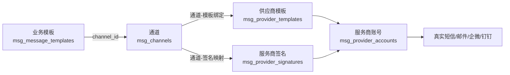

# 配置与发送指南

本文档面向首次使用 msg-push 的**业务接入方 / 管理员**，从零讲解：如何在管理后台完成「服务商 → 签名 → 模板 → 通道绑定」整套配置，以及**如何正确调用发送接口**完成消息投递。

> 假设你已经按 [快速开始](quickstart.md) 启动了后端（`:8080`）与管理后台（`:5173`），并已用默认账号 `admin / admin123` 登录。

## 一、整体概念

一次消息投递需要先搭好一条「配置链路」，发送请求才能正确路由到服务商：



- **通道（Channel）**：消息类型的逻辑渠道（短信/邮件/企业微信/钉钉），有唯一**编码**（如 `aliyun_sms`），发送接口用 `channel_code` 定位；
- **业务模板（MessageTemplate）**：业务侧的内容模板，有唯一**编码**（如 `sms_verify_code`），发送接口用 `template_code` 定位；
- **服务商账号（ProviderAccount）**：某个服务商（阿里云/腾讯云/网易/SMTP/企微/钉钉）的真实接入配置；
- **供应商模板（ProviderTemplate）**：服务商平台报备的模板（短信模板 ID 等）；
- **通道-模板绑定**：把通道 → 供应商模板 + 服务商账号关联起来，决定走哪个服务商、权重/优先级、参数映射；
- **通道-签名映射**：把业务侧的签名别名 → 具体服务商签名关联起来。

## 二、配置流程（按顺序操作）

### 第 1 步：创建服务商账号

「服务商管理」→「服务商账号」Tab →「新建账号」。

1. 选择服务商（如 **阿里云短信**）；
2. 填写账号名称（如 `阿里云短信主账号`）；
3. 在「服务商配置」分组中填写该服务商的**接入参数**（字段由后端 `sender/registry.go` 定义，前端自动渲染）：
   - 阿里云短信：`AccessKey ID`、`AccessKey Secret`、`签名`；
   - SMTP：`host`、`port`、`username`、`password`、`from` 等；
4. 点击「保存」。

> 配置参数会被整合为 JSON 存入 `msg_provider_accounts.config`，投递时发送器据此调用服务商 API。

### 第 2 步：创建服务商签名

「服务商管理」→「服务商签名」Tab →「新建签名」。

| 字段 | 说明 |
|------|------|
| 所属服务商账号 | 选择第 1 步创建的账号 |
| 签名名称 | 展示用（如 `测试签名`） |
| 签名编码 | **实际发送用的签名**，需与服务商平台报备一致 |

### 第 3 步：创建供应商模板

「服务商管理」→「供应商模板」Tab →「新建模板」。

| 字段 | 说明 |
|------|------|
| 所属服务商账号 | 第 1 步的账号 |
| 模板编码 | 服务商平台的模板 ID（如阿里云 `SMS_123456`） |
| 模板名称 | 展示用 |
| 模板内容 | 如 `您的验证码是 {code}` |
| 变量 | 逗号分隔的变量名，如 `code` |

### 第 4 步：创建通道

「通道管理」→「新建通道」。通道表默认为空，需自行创建：

| 字段 | 说明 |
|------|------|
| 通道编码 | 唯一标识（如 `aliyun_sms`），**创建后不可修改**，发送接口用 `channel_code` 定位 |
| 通道名称 | 展示用（如 `阿里云短信`） |
| 类型 | 短信 / 邮件 / 企业微信 / 钉钉 |

> 通道只定义消息类型与归属，**不配置具体服务商**；实际发送由「通道-模板绑定」关联服务商账号决定。

### 第 5 步：配置通道-模板绑定

「通道管理」→ 找到目标通道（如 `阿里云短信`，编码 `aliyun_sms`）→「详情」→「模板绑定」Tab →「新增绑定」。

1. 选择供应商模板（自动回显模板内容）；
2. 保持默认权重/优先级即可；
3. **参数映射**：选择模板后自动生成（供应商变量 → 系统变量/固定值），如 `code` 可映射到固定值或系统变量；
4. 点击「保存」。

> 一个通道可绑定多个服务商账号 + 供应商模板，按**优先级（越小越优先）+ 权重（平滑加权轮询）**分配流量，故障自动切换/熔断。

### 第 6 步：配置通道-签名映射

「通道详情」→「签名映射」Tab →「新增映射」。

| 字段 | 说明 |
|------|------|
| 签名名称 | 业务侧使用的**签名别名**（发送时 `signature_name` 传这个） |
| 供应商签名 | 选择第 2 步创建的签名 |

> **短信通道必须配置签名映射**（`RequiresSignature=true`），否则投递会失败：`required signature is missing`。

### 第 7 步：创建业务模板

「模板管理」→「新建模板」。

| 字段 | 说明 |
|------|------|
| 模板编码 | 唯一标识（如 `sms_verify_code`），**创建后不可修改**，发送接口用它定位 |
| 模板名称 | 展示用 |
| 所属通道 | 选择目标通道（如 `阿里云短信`） |
| 模板内容 | 支持 `{变量}` 占位符，如 `您的验证码是 {code}` |
| 签名 / 主题 | 填**签名别名**（与第 5 步的签名名称一致，如 `测试签名`） |

### 第 8 步：确认应用

「应用管理」确认你的应用存在且状态正常。默认内置：

- `test-app` / `test-secret`，**测试模式**（`is_test=true`，走完整链路但不真实发送，适合联调）

生产应用在「应用管理」→「新建应用」创建（正式模式），并配置每日配额与限速 QPS。

## 三、如何正确提交发送

### 认证

请求需携带应用凭证（二选一）：

```text
# 方式 A：明文密钥（简单，适合开发/测试）
X-App-Id: test-app
X-App-Secret: test-secret

# 方式 B：HMAC-SHA256 签名（推荐生产）
X-App-Id: test-app
X-Signature: <签名>
X-Timestamp: <unix秒>
X-Nonce: <随机串>
```

签名算法详见 [API 使用指南](api-guide.md)。

### 发送单条

```
POST /api/v1/messages
```

```bash
curl -X POST http://127.0.0.1:8080/api/v1/messages \
  -H "X-App-Id: test-app" \
  -H "X-App-Secret: test-secret" \
  -H "Content-Type: application/json" \
  -d '{
    "channel_code": "aliyun_sms",
    "template_code": "sms_verify_code",
    "receiver": "13800000001",
    "template_params": { "code": "123456" },
    "signature_name": "测试签名"
  }'
```

| 字段 | 必填 | 说明 |
|------|:---:|------|
| `channel_code` | | 通道编码（对应通道的 `code`）。与 `template_code` 至少传一个 |
| `template_code` | | 业务模板编码。与 `channel_code` 至少传一个：只传模板时自动定位其所属通道 |
| `receiver` | ✅ | 接收方（手机号 / 邮箱 / 用户ID） |
| `template_params` | | 模板变量值（key-value） |
| `signature_name` | 短信必填 | 签名别名（对应通道-签名映射的签名名称） |
| `scheduled_at` | | 定时发送时间（ISO8601） |

> `channel_code` 与 `template_code` **至少传一个**。只传 `template_code` 时，系统自动定位模板所属通道发送；两者都传时校验模板属于该通道；都不传报错。
> 例如只传模板：`{"template_code":"sms_verify_code", "receiver":"13800000001", "signature_name":"测试签名"}`。

### 发送批量

```
POST /api/v1/messages/batch
```

```bash
curl -X POST http://127.0.0.1:8080/api/v1/messages/batch \
  -H "X-App-Id: test-app" -H "X-App-Secret: test-secret" \
  -H "Content-Type: application/json" \
  -d '{
    "channel_code": "aliyun_sms",
    "template_code": "sms_verify_code",
    "receivers": ["13800000001", "13800000002"],
    "template_params": { "code": "123456" },
    "signature_name": "测试签名"
  }'
```

> 批量发送：消费端优先调用服务商**批量 API**（阿里/腾讯/网易短信支持），不支持时自动退回逐条。

## 四、验证投递结果

### 查询任务

```bash
curl http://127.0.0.1:8080/api/v1/tasks/{task_id} \
  -H "X-App-Id: test-app" -H "X-App-Secret: test-secret"
```

任务状态流转：`pending → sending → success / failed`。

### 管理后台查看

- **任务查询**：按任务号 / request_id 查看状态、模式、耗时；
- **日志查询**：查看推送日志（含服务商响应快照）、回调日志；
- **数据总览**：今日发送 / 成功 / 失败 / 成功率。

## 五、常见问题

| 现象 | 原因 / 解决 |
|------|------|
| 任务 `failed`：`required signature is missing` | 短信通道强制要求签名：① 配置通道-签名映射；② 发送时传 `signature_name` |
| 任务 `failed`：`channel not found or disabled` | `channel_code` 填错或通道被禁用 |
| 任务 `failed`：`template not found or not bound to channel` | `template_code` 不存在，或该模板未绑定到所选通道 |
| 任务 `failed`：`provider account not found` | 服务商账号未配置，或通道-模板绑定未关联服务商账号 |
| 任务 `failed`：`CONFIG_ERROR` | 服务商账号的接入参数缺失（如没填 AccessKey） |
| 测试应用发送显示成功但没收到真实短信 | 正常现象：`test-app` 是测试模式（`is_test=true`），模拟成功不真实发送 |

## 相关文档

- [快速开始](quickstart.md)
- [API 使用指南](api-guide.md)
- [测试模式](testing-mode.md)
- [失败处理与重试](failure-retry.md)
- [新增短信服务商](add-new-sms-provider.md)
