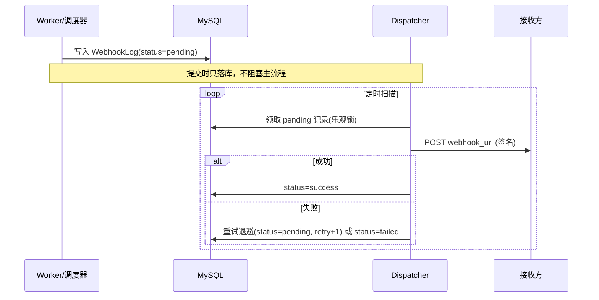

# Webhook 通知

msg-push 支持将消息状态变更（成功/失败/送达等）通过 Webhook 实时推送给调用方，采用 **outbox 模式**异步投递，保证通知不丢失。

## 一、配置

Webhook 配置存于 `msg_webhook_configs` 表（管理端 `/webhook-configs`）。

| 字段 | 说明 |
|------|------|
| name | 配置名称 |
| app_id | 绑定应用（0=全应用） |
| webhook_url | 回调地址 |
| secret | 签名密钥（可选） |
| events | 订阅事件，逗号分隔，如 `success,failed` |
| status | 启用/禁用 |
| retry_count | 最大重试次数（默认 3） |
| timeout | 请求超时秒数（默认 5） |

### 支持的事件

| 事件 | 触发时机 |
|------|----------|
| `success` | 任务发送成功 |
| `failed` | 任务发送失败（含超时） |
| `delivered` | 回调确认送达 |

## 二、通知流程（outbox 模式）



- **提交解耦**：发送流程只写入 outbox 日志，实际 HTTP 投递由 `webhookx.Dispatcher` 异步完成；
- **可靠性**：记录落库（不依赖内存队列），重启不丢；
- **多实例安全**：领取时用乐观锁（random token）防并发重复投递。

## 三、请求体

通知为 `POST`，`Content-Type: application/json`，示例：

```json
{
  "event": "success",
  "task_no": "task_xxx",
  "app_id": 1,
  "status": "success",
  "provider_id": "服务商消息ID",
  "receiver": "13800000001",
  "error_code": "",
  "error_msg": "",
  "timestamp": 1720000000,
  "request_id": "a1b2c3d4-..."
}
```

> `request_id` 为全链路追踪 ID，与提交请求一致，方便接收方关联。

回调（回执）类通知额外包含 `provider_id` / `mobile` / `callback_status` 等字段。

## 四、签名校验

配置了 `secret` 时，投递请求携带签名头：

```
X-Webhook-Signature: <hex>
X-Webhook-Timestamp: <unix秒>
```

签名算法：

```text
signature = hex( HMAC-SHA256(secret, "<timestamp>.<body>") )
```

接收方可用相同算法校验，防伪造。`X-Webhook-Timestamp` 建议做时间窗校验（±5 分钟）。

## 五、重试与超时

- 投递失败按退避重试，默认最多 3 次：`delay = (retry+1) * 5s`；
- 超过最大重试次数置 `status=failed`，保留 `error_message`；
- 单次请求超时由配置 `timeout` 控制（默认 5s）。

## 六、日志查询

管理端 `GET /api/v1/account/webhook-logs` 可查询投递日志，支持按 `task_no` / `request_id` / `status` 过滤，方便排查。

## 相关文档

- [API 使用指南](api-guide.md)
- [数据模型](database.md)
- [失败处理与重试](failure-retry.md)
